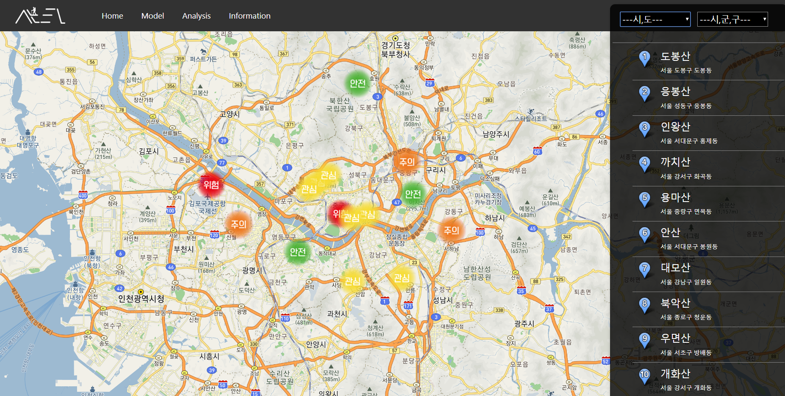
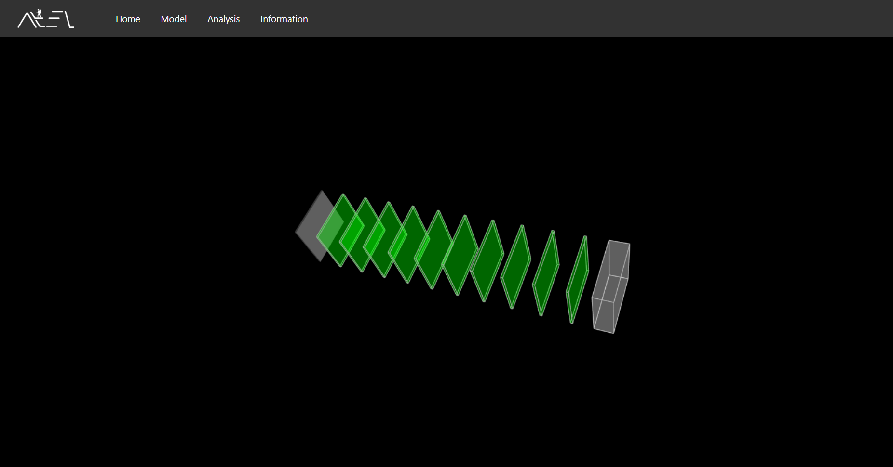
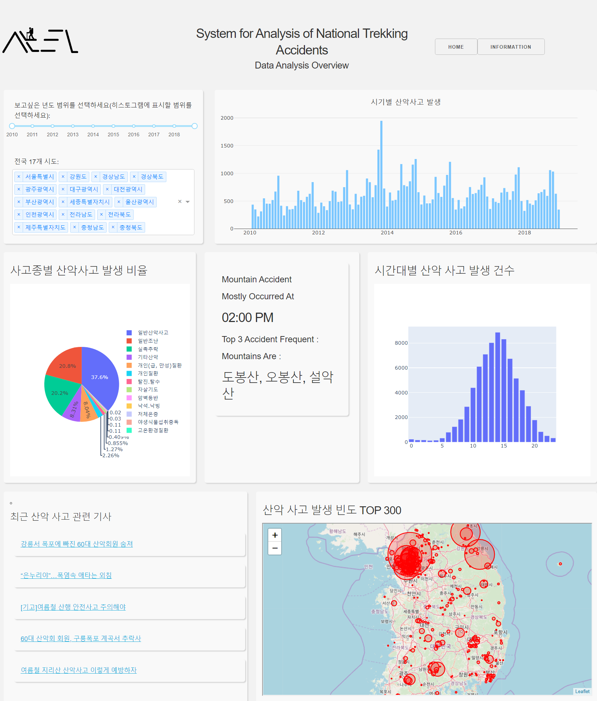
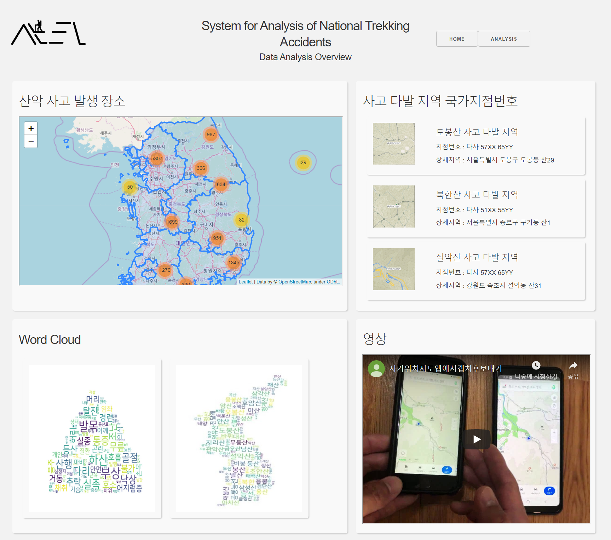

# SANTA (System for Analysis of National)
-----
 Trekking Accidents
 **위치기반 산악사고 위험 예측 시스템**
## Screenshots
### 메인화면

### 모델 시각화

---
### 분석 탭

---

### 기타 정보

### Environment
- Flask

### Tech
- **Sytem tool**
    - jquery
    - javascript
- **Analysis tool**
    - python
    - numpy
    - pandas
    - tensorflow
    - keras
    - scikit-learn
- **Visualization tool**
  - folium
  - dash
